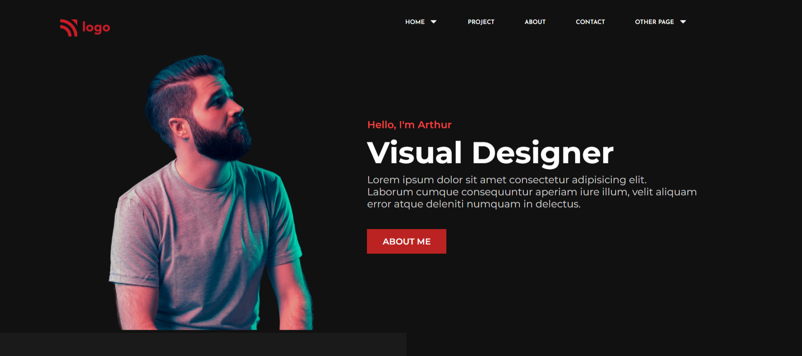

# **Product Design LandingPage | Project_15**

Hello, I'm **Vikash Yadav** 

This project is a part of the **Full Stack Javascript** course by ineuron.ai. It is given by our instructor and mentor, **Hitesh** sir,  as an assignment.

### **What I have learned ?**

In this, I have learned about

- html structuring
- css grid
- after pesudo selector

### **Time spent to finish it.**

It took me 6 to 7 hours to complete this project.

**Note :** This project is not optimized for mobile yet.

**[Live Project's netlify link](https://product-design-project-15.netlify.app/ "Project link")**

